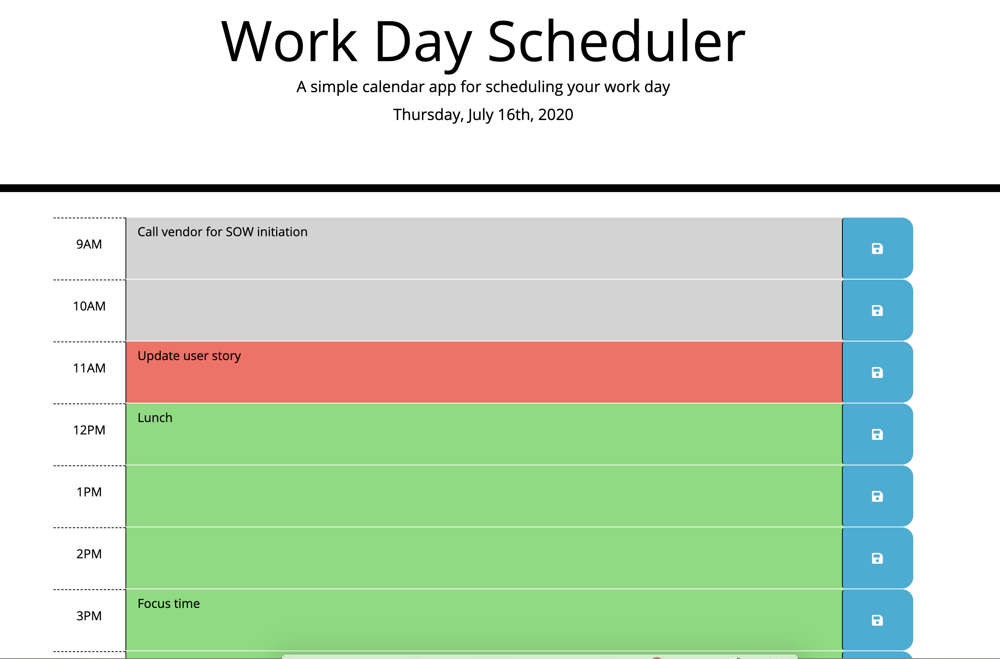

# Coding Assessment

## Application
Published on https://hngdngng.github.io/work-day-planner/

## Description
The goal of this project was to create a simple calendar application that allows the user to save events for each hour of the day. This app shall run in the browser and feature dynamically updated HTML and CSS powered by jQuery.

## Languages
HTML5, CSS, Javascript (JQuery)

## Features
The website features the following:
* Dynamically updated HTML and CSS powered by JQuery
* Clean user interface
* Valid and correct HTML (using a validation service)
* Color changes based on current time (green: future hours, red: current hour, gray: past hours)
* User calendar entries stored on local storage
* Calendar entries displayed upon page re-load

The following image demonstrates the application functionality:

## Author
Hoang Nguyen
